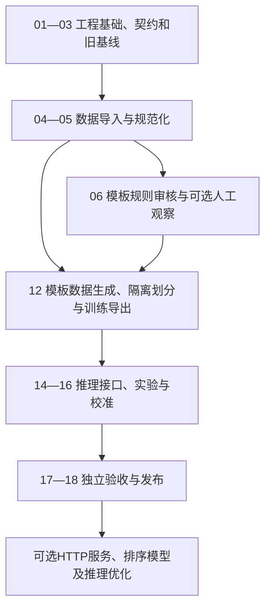

# Anitopy-ML 项目分步实施计划

## 当前实施变更（2026-09-20）

- [x] 合成器支持 `title_alias_begin`、局部 `noise2` 和 `%random_str($字符串来源, 最大连续字符数)`；标题与别名无明确边界、多个别名无分隔符的模板会被拒绝。
- [x] 合成器支持 `$title_en`（英文主标题，`TITLE`）、`$title_cn`（中文名称，`TITLE_ALIAS`）和带数字的 `$title_as_title_alias_1` 占位符。
- [x] 英文主标题优先作为作品双隔离分区键；旧标题字段仍可读取，保证旧模板可用。
- [x] 已通过合成数据单元测试（12 项）。
- [x] 已保存使用 `$title_en` 的模板，并生成 V6 原始数据、去重数据和作品/模板组双隔离分区。
- [x] 合成器支持模板组局部 `$noise` 字段并标注为 `NOISE`，用于下一数据版本抑制月份新番文本被误识别为标题。
- [x] V6 已完成训练、校准和冻结评测；冻结测试已消费且未通过发布。
- [x] V8 噪声字段数据和冻结评测已归档；冻结测试已消费且未通过发布。
- [x] V9 已生成 179,993 条唯一合成样本，覆盖 28 个模板和 9 个模板组；双隔离导出训练 109,155、验证 2,792、冻结测试 1,775 条。
- [x] V9 三随机种子训练、校准和冻结评测已完成；冻结实体 F1 为 0.8583、整条严格完全正确率为 19.32%，未通过发布且冻结测试已消费。
- [x] V10 已从更新后的 `data.json` 生成 299,988 条唯一样本，覆盖 42 个模板条目（41 条不同模板文本）和 9 个模板组；训练/验证/冻结测试分区为 196,709 / 3,510 / 2,123，BIO 审计无异常。
- [x] V10 三种子训练已完成；验证实体 F1 均值 86.58%、标准差 1.93 个百分点。名称与别名联合正确率未达候选门槛，V10 不校准；为定位失败已检查冻结分区模板结构，后续必须重建新的冻结分区。
- [x] V11 已生成 299,992 条唯一样本，并按作品隔离、模板条目全覆盖划分为训练 251,096、验证 21,307、新冻结测试 27,589 条；42 个模板条目均覆盖到三个分区。首个权重初始化训练的验证实体 F1 为 98.83%、名称与别名联合为 99.11%。
- [x] 用户清理模板后已生成 V12 探针数据：30,000 条唯一样本、BIO 审计零异常、42 个模板条目全覆盖；V11 在新的 2,199 条作品隔离验证集上取得实体 F1 99.86%、名称与别名 100%、季数 100%、集数 97.77%、核心字段整条 97.77%，达到下一版正式训练的候选门槛。
- [x] V11 已仅使用 V12 验证分区完成校准和接受策略固定，并在未读的 V12 测试分区完成一次冻结评测：实体 F1 99.78%、名称与别名 100%、季数 100%、集数 99.45%、核心字段整条 99.45%，通过当前模板体系的冻结发布门槛。

依据：[task.md](task.md)。计划日期：2026-09-17。

`task.md` 定义功能、技术方案和效果目标；本文定义开发顺序、工作拆分、文件交付、验证方式及阶段完成条件。涉及字段含义、接口参数和标注规则时，以 `task.md` 为准；实施中改变设计须同步两份文档。

## 当前训练数据决策（2026-09-18，优先级最高）

训练、验证和测试数据均改由 `data.json` 的标题条目、字段词表和 `name_template[].name` 生成，并由模板替换位置自动标注为 BIO。`data.csv` 不再进入任何训练分区；当前训练不使用外部作品库数据。人工审核仅用于审查模板规则和未来真实场景观察，不再是训练启动条件。

训练集不设固定样本数目标或上限。`data generate-synthetic --count` 是单次执行批次参数，可持续分批生成、去重后并入训练分区；当前 10,000 条只是已生成的首批产物。生成验证与测试时必须按作品条目和模板组隔离，评测报告必须标注为“模板分布内评测”，不得宣称真实发布标题准确率。

生成器默认以 `--season-rate 0.7` 从含 `season_expr` 的标题条目抽样，并将词表中的 `%random(位数)` 渲染为补零随机正整数；例如 `%random(2)` 生成 `01` 至 `99` 的 `EPISODE_EXPR`。每个新批次必须先按“原文 + 完整 BIO 标签”去重，再进行双隔离划分。

本文中的代码、命令和产物均为待实现项。编写计划不代表功能已完成；任务只有在代码、对应验证和交付记录齐备后才能勾选。

## 1. 当前起点与实施约定

### 1.1 已有基础

| 项目 | 当前状态 | 后续处理 |
| --- | --- | --- |
| 需求与方案 | 已有 `task.md` | 作为开发与验收依据 |
| 项目配置 | `pyproject.toml` 已声明 Python `>=3.12`，依赖为空 | 验证环境、补充构建配置和可选依赖 |
| 现有环境 | `venv` 为前次调研中的 Python 3.14 环境 | 新建独立 `.venv`，实际版本由环境检查确认 |
| 模板训练源 | `data.json`，包含标题、字段词表和7组名称模板 | 作为唯一训练、验证和测试数据来源；按模板自动标注并保留生成清单 |
| 原始标题 | `data.csv`，前次统计为28,780条 | 仅保留旧解析基线、人工浏览和未来真实场景观察，不进入训练分区 |
| 旧解析器 | `E:\Code\anitopy` | 固定提交、保留许可并建立兼容基线 |
| 功能代码与模型 | 尚未建立 | 从步骤01开始实施 |

`task.md` 第2.2节中“新项目要求 Python >=3.14”的描述属于此前调研快照；本计划以当前 `pyproject.toml` 的 `>=3.12` 为起点。支持范围的最终声明应与实际验证的运行环境一致。

### 1.2 每一步的执行规则

1. 先满足前置条件，再完成代码和产物，最后执行本步验收；存在依赖失败时继续处理不依赖它的任务。
2. 每步形成一个可独立审查的工作单元；若使用版本控制，按步骤拆分提交，避免把数据清洗、训练和接口改动混在一次提交中。
3. 所有自编注释、文档字符串、命令帮助、日志、错误和界面文本使用中文。标识符、协议字段及第三方专有名称保留稳定形式。
4. 原始CSV保持不可变，派生数据写入 `data/`；模型写入 `artifacts/`，报告写入 `reports/`，缓存、凭证和大模型文件不进入普通源码提交。
5. 推理默认离线，模板数据来源、模板版本和生成参数可追溯；模板确定性标签可用于训练，但不能被表述为人工金标。
7. 阶段结束记录验证命令、产物位置、结果与未完成事项；完成某个代码步骤不等于完成整个项目。

## 2. 路线、依赖与里程碑

### 2.1 执行路线



离线主线：**01→02→03→04→05→06→07→08→12→13→14→15→16→17→18**。


这里的支线表示依赖关系，不要求并行人员或多代理执行。单人开发可按依赖逐项推进。

### 2.2 阶段交付

| 里程碑 | 对应步骤 | 可交付能力 | 对应 `task.md` 阶段 | 工程估算 |
| --- | --- | --- | --- | --- |
| M0 | 01—03 | 可安装、中文CLI、契约明确、旧结果可复现 | P0 | 2—3工作日 |
| M1 | 04—05、07中的分组基础 | 原始数据可追溯，清洗与作品分组可验证 | P1 | 3—4工作日 |
| M2 | 06、12 | 模板规则审核、自动标注生成及隔离分区 | 模板数据 | 按模板变更持续执行 |
| M4 | 12—13、15 | 训练、恢复、实验比较及候选模型 | P4 | 5—7工作日 |
| M5 | 14、16 | 离线调用、批量解析、兼容层及校准 | P5 | 3—5工作日 |
| M6 | 17—18 | 独立评测、发布包和中文使用文档 | P6 | 3—5工作日 |
| M7 | 可选任务 | HTTP服务、排序模型、量化及反馈循环 | P7及扩展 | 按实际选择另估 |

M0—M6工程量合计约23—35工作日；沿用 `task.md` 的P7优化预算3—5工作日时，总计约26—40工作日。新增HTTP部署或文件探测另行估算。该估算不含完整人工标注工时、外部条件等待和所有训练实验的机器运行时间；第一个小批次完成后更新估算。

M2的工程完成指模板生成器、自动 BIO 标注、生成清单和按作品/模板隔离的分区验证通过。训练样本数量不设目标或上限；每次生成由清单、种子、模板版本和去重结果记录。

## 3. 第一步到第三步：工程基础与旧基线

### 步骤01：建立项目骨架与可复现环境

**前置条件：** 无。**需求对应：** `task.md` 第2、7、8节。

主要文件：`pyproject.toml`、`uv.lock`、`.gitignore`、`src/anitopy_ml/__init__.py`、`cli.py`、`messages.py`、`tests/`、`docs/开发环境.md`。

- [x] 配置 `src` 包结构、构建后端和 `anitopy-ml` 命令入口。
- [ ] 新建Python 3.12 `.venv`，保留现有 `venv`；记录操作系统、CPU、内存及可用GPU。
- [x] 按基础、`train`、`review`、`serve`、`dev` 拆分依赖，验证后生成锁文件；基础导入不强制安装训练栈。
- [x] 实现中文顶层帮助、版本信息、统一异常出口及最小 `doctor`。
- [x] 配置必要的测试和静态检查入口，后续按功能加入有效测试。

**验证与完成标准：** 在新环境完成安装，`uv run anitopy-ml --help` 显示中文帮助；`doctor` 能区分基础环境可用、训练依赖缺失和可选GPU不可用；基础包不因未安装可选组件而导入失败。交付 `reports/环境检查.json`。

### 步骤02：固定数据结构、字段规则和错误契约

**前置条件：** 步骤01。**需求对应：** 第4、10节。

主要文件：`src/anitopy_ml/schemas.py`、`errors.py`、`messages.py`、`provenance.py`、`configs/标签定义.json`、`docs/字段契约.md`、`tests/unit/test_schemas.py`。

- [x] 定义 `Span`、`Evidence`、`ExtractedFields`、`CatalogMatch`、`ParseResult`、`AnnotationRecord`、`ModelManifest`。
- [x] 固定片段标签、BIO映射、未知值、字段列表顺序和集数十进制字符串形式。
- [x] 校验原文片段、字符偏移、范围起止和字段类型；分离原文提取与作品库补充。
- [x] 定义 `status`、`link_status`、错误码、中文信息，以及模型/Schema/规范化版本关系。
- [x] 定义来源记录和用途检查接口，为人工标注提供同一契约。

**验证与完成标准：** `task.md` 示例通过结构校验和JSON往返转换；越界片段、错位文本和字段类型混淆等输入被明确拒绝；缺失季数不会自动补1。

### 步骤03：接入冻结旧实现并建立可执行基线

**前置条件：** 步骤01、02。**需求对应：** 第2.1、10.4、11节。

主要文件：`src/anitopy_ml/legacy.py`、旧实现的固定依赖或隔离副本、`tests/fixtures/legacy/`、`tests/regression/test_legacy.py`、基线命令模块。

- [x] 固定原项目提交 `48bd0ad6f0d074c54e1694ee85d96828fd043209`，保留许可、来源和版权声明；不依赖运行机器上任意版本的绝对路径。
- [ ] 保存162条常规及35条已知失败用例；同时保存历史预期与冻结旧实现的实际输出。
- [x] 实现逐条比对、字段差异、异常记录及汇总报告，不再依赖被注释或被吞掉的断言。
- [x] 包装旧接口，复制调用者的选项字典；保持旧输出形态。
- [x] 实现 `baseline` 命令，为后续真实金标评测准备输出适配器。

**验证与完成标准：** 可复现153/162与0/35的历史预期匹配结果；兼容回归对197条旧实际输出全部一致；调用前后的选项字典不变。报告明确区分“旧行为兼容”与“解析正确率”。

## 4. 第四步到第五步：数据导入与规范化

### 步骤04：实现CSV导入、统计及数据清单

**前置条件：** 步骤02；基线关联依赖步骤03。**需求对应：** 第2.2、5.1节。

主要文件：`src/anitopy_ml/data/ingest.py`、`profile.py`、`manifest.py`、`configs/数据处理.yaml`、`tests/unit/test_ingest.py`。

- [x] 使用标准CSV解析器读取 `record_title`，检查编码、空值、记录结构及异常长度。
- [x] 生成稳定样本ID，保存源文件哈希、CSV记录序号和原文哈希；重复导入保持幂等。
- [x] 生成 `data/raw/titles.jsonl` 和数据清单，提供精确去重与异常记录。
- [x] 实现 `data ingest`、`data profile`，输出长度、语言模式、常见字段、噪声和重复统计。
- [x] 对CSV运行旧解析器，保存后续预标注和错误分析用的基线结果。

**验证与完成标准：** 当前文件哈希与 `task.md` 一致时，应导入28,780条、无空值且无完全重复；不一致时报告数据版本变化。带逗号、引号和换行的测试CSV仍正确导入，原文件不被改写。

### 步骤05：实现可追溯清洗和字段规范化

**前置条件：** 步骤02、04。**需求对应：** 第4、5.1、11.3节。

主要文件：`src/anitopy_ml/normalizer.py`、`constraints.py`、`data/preprocess.py`、`tests/unit/test_normalizer.py`、`test_constraints.py`。

- [x] 分离原文、模型输入视图、检索视图；实现全角/空白处理及区间位置映射。
- [x] 标记网址、BBCode和正文噪声，保留所有被移除区域的来源位置。
- [x] 实现季集表达、范围、声明集数、字幕方式、音视频术语的规范化函数。
- [x] 保留主标题内数字、前导零、特别篇和未知编号体系，不通过数字位置单独决定语义。
- [x] 定义超长输入处理和滑窗所需的全局偏移接口；滑窗词元实现留到步骤12。

**验证与完成标准：** 验证多字符替换、删除、全角字符及非BMP字符位置回映射；`01-12`、`01&03`、`12.5`、`全12集`得到不同结构；不能把4K声明解释为已经探测的真实宽高。

## 5. 第六步到第八步：标注工具与金标

### 步骤06：实现标注存储、预标注和中文审核界面

**前置条件：** 步骤02—05。**需求对应：** 第4.3、5.2、8节。

主要文件：`src/anitopy_ml/annotation/store.py`、`seed.py`、`review.py`、`tools/model_verify_app.py`、`docs/模型验证页面.md`、相关集成测试。

- [x] 建立SQLite样本、片段、结构字段、来源、审核状态、审核历史和版本表，并提供迁移机制。
- [x] 实现 `annotate seed`，将旧规则结果转换为可编辑建议；未确认区域保留未标注状态。
- [x] 实现中文原文片段选择、标签切换、季集编辑、保存、撤销、无法判断和复核队列。
- [x] 增加作品组手工编辑入口，用于冻结数据划分。
- [x] 处理前端UTF-16与后端Unicode码点偏移差异；人工修改采用版本冲突检测。

**验证与完成标准：** 一个样本可完成预标注→编辑→复核→导出→再次加载，片段和版本一致；未审核标签不会变成金标；多个编辑会话不会静默覆盖；所有自编提示中文。

### 步骤07：建立作品分组并冻结数据用途

**前置条件：** 步骤04—06。**需求对应：** 第5.3节。

主要文件：`src/anitopy_ml/data/grouping.py`、`split.py`、`leakage.py`、`data/splits/split_manifest.json`、`reports/数据划分报告.json`。

- [ ] 根据保守标题聚类、近重复及人工作品组建立 `work_group_id`；可信外部ID仅作为可用证据之一。
- [x] 将同作品不同集、别名、清晰度和发布组变体合并分组；疑似同组但不确定的样本集中复核或隔离。
- [x] 实现 `data split`，固定训练、验证、测试归属、随机种子、数据版本和分组依据。
- [x] 全量池以约80/10/10为分配目标；人工金标约2,500/500/1,000的抽样预算独立安排，不要求两个比例完全一致。
- [ ] 实现作品交叉、近重复、派生样本和来源泄漏检查；划分后的新增别名合并必须重新审计跨分区冲突。

**验证与完成标准：** 同作品的不同集不跨分区；重复运行得到相同清单；主动构造的泄漏能够被检测并阻止导出。冻结测试组不能用于后续规则调优或候选阈值拟合。

### 步骤08：维护模板覆盖并生成隔离训练与评测样本

**前置条件：** `data.json`、步骤02、05、12。**需求对应：** 模板自动标注与训练数据隔离。

主要产物：`data.json`、`data/synthetic/`、生成清单、模板覆盖报告与重复检查报告。

- [x] 按 `name_template[].name` 生成标题，并以模板替换位置自动标注 BIO；别名循环、中文/英文字幕字段和季数拆分已由单元测试覆盖。
- [x] 按标题条目与模板组隔离训练、验证、测试，生成清单中记录种子、模板组分配、完整标签表和文件哈希。首批双隔离分区为训练5,878、验证105、测试135条。
- [ ] 持续扩充模板组合，不设置训练样本数目标或上限；每批结果去重后可追加到训练分区。
- [ ] 统计字段与模板覆盖不足，优先补充 `data.json` 的词表或模板，而不是采集外部训练样本。
- [ ] 人工抽查模板文字与自动标签边界，发现规则错误时修订模板并重新生成受影响批次。

**验证与完成标准：** 每条生成样本的片段、字符序列和 BIO 标签一致，来源为 `synthetic_template`；训练、验证和测试间不共享标题条目或模板实例。评测结论仅适用于该模板体系，不对真实发布标题作准确率声明。

## 7. 第十二步到第十三步：训练数据与训练工具

### 步骤12：实现训练导出、标签对齐和增强工具

**前置条件：** 步骤02、05与 `data.json` 模板源。**需求对应：** 模板 BIO 自动标注、隔离划分与训练对齐。

主要文件：`src/anitopy_ml/data/export.py`、`augment.py`、`training/dataset.py`、`collator.py`、标签对齐和泄漏测试。

- [x] 实现模板训练数据生成，按 `name_template` 自动导出字符级 BIO JSONL、片段和来源清单。
- [x] 实现模板数据的作品条目与模板组隔离划分，导出训练、验证、测试JSONL及标签映射。
- [x] 使用fast tokenizer字符偏移对齐BIO标签，未知区域、特殊词元和填充不计算损失。
- [x] 输出无法对齐的样本和原因，避免自动移动人工边界。
- [x] 实现动态填充、长标题滑窗与全局偏移；对重叠窗口定义去重损失掩码，避免重复区域被过度训练。
- [x] 实现仅作用于训练组的增强，变换后重建标签，保留父样本ID和作品分组。

**验证与完成标准：** 模板替换位置与 BIO 标签严格一致；验证/测试不含训练标题条目或训练模板实例；模板来源和生成参数可复现。长文本不会静默截断。

### 步骤13：实现多任务模型与训练器

**前置条件：** 步骤01、02、12及可用模板生成分区。**需求对应：** 第3.1、8.3—8.5节。

主要文件：`src/anitopy_ml/modeling/model.py`、`heads.py`、`decoder.py`、`training/trainer.py`、`metrics.py`、`checkpoint.py`、`configs/抽取训练.yaml`、`tools/smoke_train.py`。

- [x] 固定 `FacebookAI/xlm-roberta-base` 及分词器revision，实现BIO头和资源形态/媒体类型分类头。
- [ ] 实现任务缺失掩码、金银标权重、多任务损失及受约束BIO解码。
- [x] 实现梯度累积、梯度裁剪、设备适配、混合精度、验证实体指标与早停。
- [x] 检查点保存模型、优化器、调度器、随机状态与训练进度，提供恢复训练。
- [x] 实现 `train extractor` 和中文训练报告；每次实验保存配置、训练数据清单哈希、检查点和环境相关设备信息。本地 XLM-R 权重下载后即可执行正式训练。
  - [x] 已用模板生成数据完成训练、保存/加载和检查点恢复自检；早期实验结论已归档至 `reports/历史训练与评测汇总.md`，对应检查点已淘汰。

**验证与完成标准：** 小集合损失有效下降且能够拟合，标签和解码无系统性错位；恢复训练进度、优化器状态正确；相同检查点加载后的推理一致。GPU不足可降低批量或使用CPU自检，但完整训练工期据实更新。

## 8. 第十四步到第十六步：推理、模型实验与校准

### 步骤14：实现离线推理、混合判定和稳定调用接口

**前置条件：** 步骤02、03、05、13的可加载检查点。**需求对应：** 第3.3、10节。

主要文件：`src/anitopy_ml/inference/loader.py`、`pipeline.py`、`batch.py`、`api.py`、CLI推理模块及接口测试。

  - [x] 实现 `MediaParser.from_pretrained()`、`parse()`、`parse_batch()`。本地字符检查点与 XLM-R 检查点均可离线加载，单条解析和逐条错误隔离已验证。
  - [ ] 合并滑窗结果、映射原文证据，并以同一规范化和约束层生成最终字段。已实现单窗口的 `inference/decoding.py`：BIO标签会严格还原为原文证据，并与约束层字段合并；滑窗模型输出合并待实现。
- [ ] 实现 `semantic / hybrid / legacy` 路径；规则与模型冲突时记录证据和状态。
- [ ] 实现顶层旧接口 `parse()` 与 `to_legacy_dict()`，明确有损映射；严格兼容路径不额外添加破坏旧结构的键。
  - [x] 实现 `parse`、`batch` 命令，保持批量顺序并隔离单条错误。
  - [x] 默认断网加载；模型不存在时给出中文报错。

**验证与完成标准：** 使用步骤13小模型通过接口联调，不将其效果作为正式模型能力；断网测试无任何联网尝试；旧选项和197条冻结输出兼容；单条和批量对同一输入结果一致。

### 步骤15：运行正式训练与对照实验

**前置条件：** 步骤08的模板训练/验证分区、步骤12—14。**需求对应：** 第8.4、8.5节。

主要产物：`artifacts/runs/` 下的当前实验目录、`reports/历史训练与评测汇总.md` 与完整配置和日志。

- [x] 实验A：仅模板自动标注数据，建立模板验证集基线；结果已归档至 `reports/历史训练与评测汇总.md`。
- [x] 实验B：在相同作品/模板隔离划分下比较不同字段词表和模板组合。可选字段填充率为0.6的变体最佳验证实体F1为0.8936，未显示收益，不采用。
- [x] 实验C：加入训练集增强，检查对隔离模板验证集的影响。空白增强的最佳验证实体F1为0.8996，低于未增强字符边界实验一的0.9280，因此不采用。
- [ ] 比较严格实体F1、关键字段完全正确率及各困难类别，不能只按训练损失选择。
- [x] 已完成早期候选的三随机种子复测并记录波动；旧结果已归档至 `reports/历史训练与评测汇总.md`，不再作为 V6 候选依据。
- [x] 旧候选的模型、规则和标签版本已固定并完成独立评测；对应检查点已淘汰，后续不得加载或复用。

**验证与完成标准：** 每个采用的改动有对照证据；报告明确为模板分布内结果，不将合成验证集指标等同于真实标题效果。交付完整可复现实验记录。

### 步骤16：校准置信度并确定接受策略

**前置条件：** 步骤14、15。**需求对应：** 第3.1节。

主要文件：`src/anitopy_ml/inference/calibration.py`、`training/calibrate.py`、`configs/推理.yaml`、模型校准文件。

- [x] 实现 `calibrate`，仅用验证集拟合字段置信度与接受阈值。候选模型的 `calibration.json` 已生成并绑定检查点 SHA256。
- [x] 已验证置信度分桶和覆盖率—错误率链路；旧校准结果已归档至 `reports/历史训练与评测汇总.md`，不能迁移到 V6。
- [x] 确定拒绝判断、部分结果和回退策略，保存配置哈希及适配的模型版本。`acceptance_policy.json` 使用0.7阈值，低置信度或未校准字段保留证据并提示复核；主标题不达标时返回`partial`，权重哈希不匹配时拒绝加载校准器或策略。
- [x] 固定最终配置，写明尚未支持的类别和低证据情形。当前策略仅适用于模板验证分布，`video_term`、`bit_depth`等未校准字段不能自动接收。

**验证与完成标准：** 置信度状态可解释，未知或样本不足时不冒充已校准概率；阈值与模型包绑定；全部拒绝不能获得虚假的“高质量通过”。

## 9. 第十七步到第十八步：独立验收与发布

### 步骤17：完成冻结测试、性能测试与发布判定

**前置条件：** 步骤08测试金标完成、步骤15、16配置固定。**需求对应：** 第11节。

主要文件与产物：`src/anitopy_ml/training/evaluate.py`、回归/集成测试、当前版本的评测报告与 `reports/历史训练与评测汇总.md`。

- [ ] 对旧规则、语义模式和混合模式在同一冻结测试集评测。已完成语义候选的独立测试；旧规则与混合模式对照尚未实现，且当前语义指标已不满足发布条件。
- [ ] 输出严格实体F1、名称与别名联合、季数、集数、核心字段整条完全正确率及按作品组估计的95%置信区间。严格实体F1和全部字段统计只用于诊断；发布仅以四项核心指标判定。当前合成测试只有79个标题条目和7个模板组，分区后测试样本有限，未给出会造成误导的作品组95%区间。
- [ ] 分别报告混合语言、数字标题、合集、特别篇、未知作品和媒体类型效果及样本量。
- [ ] 测试CPU冷启动、热启动P50/P95、批量吞吐和内存，固定硬件、线程和长度条件；网络关联单列。
- [ ] 验证缺模型、离线、缓存损坏和超长输入路径。
- [x] 对照下表记录“通过、未通过、未验证”，不通过时返回对应步骤；早期发布判定均为不通过，已归档至 `reports/历史训练与评测汇总.md`。

| 验收项 | 沿用 `task.md` 的目标 | 记录要求 |
| --- | --- | --- |
| 名称与别名联合 | 完全正确率≥95% | 标签类型可互换，允许合并为连续名称实体，但整体起止边界必须正确 |
| 季数 | 适用样本完全正确率≥97% | 仅在存在季数表达的样本中统计 |
| 集数 | 适用样本完全正确率≥97% | 集数表达、范围和声明总集数合并核对 |
| 核心字段整条 | 完全正确率≥95% | 仅比较名称与别名联合、季数和集数 |
| 发布组及技术字段 | 观察指标 | 必须逐字段报告，但不作为发布阻断条件 |
| 兼容性 | 197条冻结旧输出一致 | 历史正确预期匹配率另列 |
| 离线推理性能 | 指定CPU、批量1、≤256词元时热启动P95暂定≤300毫秒 | 硬件确定后据实验证，不提前承诺 |

**完成标准：** 报告完整且证据可复查；未达标能力不标记为发布达标。

### 步骤18：打包模型、编写调用文档并完成发布演练

**前置条件：** 步骤17对本次发布范围验收通过。**需求对应：** 第9、10.6、11、14节。

主要文件：`src/anitopy_ml/export.py`、`artifacts/releases/媒体解析模型-v1/`、`docs/训练指南.md`、`调用指南.md`、`模型说明.md`、`examples/`。

- [ ] 实现 `export`，打包权重、分词器、标签映射、规范化配置、校准器及模型清单。
- [ ] 保存代码/数据版本、依赖锁定信息、适用范围、指标、来源许可和中文模型卡。
- [ ] 将 `task.md` 中的Python、批量CLI和显式关联示例改为实际可执行示例，逐一验证。
- [ ] 在干净环境安装包并断网加载模型，验证单条、批量和旧调用方式。
- [ ] 编写从导入、标注、训练、校准、评测到发布的完整操作指南，说明检查点恢复和常见中文错误。
- [ ] 完成影子结果对比与回滚演练，模型、规则和校准器整体切换。

**完成标准：** 发布包无需训练缓存即可使用；示例命令实际运行通过；可回滚至上一模型包或显式旧规则路径。每个尚未实现的可选功能在文档中有明确状态。

## 10. 首版之后的可选任务

这些任务不应阻塞离线解析首版；实施后分别补充验收记录。

| 编号 | 前置条件 | 实现与产物 | 完成标准 |
| --- | --- | --- | --- |
| O01 HTTP服务 | 步骤14、18 | `serving/app.py`，`serve`命令，单条/批量/健康/模型信息端点 | 默认本地监听；中文错误；复用模型；服务与库输出一致；批量和输入长度受控 |
| O03 ONNX或量化 | 步骤17性能结果支持优化需要 | 导出器、推理后端和性能报告 | 原始模型对照、字段一致性、精度损失和实际延迟均有验证 |
| O04 主动学习闭环 | 已有真实使用反馈 | 低置信度、冲突和纠错样本队列，数据版本更新流程 | 先复核后训练，保留血缘，冻结测试不回流当轮训练 |
| O05 实际文件探测 | 用户提供文件路径和相应需求 | `probe_file()`、`observed_media`字段 | 标题声明与实际探测分离，冲突中文提示，不根据标题网址下载文件 |

O02的模型改动必须重新执行步骤16—18；O03等影响预测行为的改动也需要相应回归与发布评测。

## 11. 按里程碑执行的验证命令

以下是工具实现后的计划验证入口；当前不能假设这些命令已经存在。完整用法沿用 `task.md`，实施中同步更新实际参数。

### 11.1 工程与数据阶段

```powershell
# 检查环境及中文命令帮助
uv run anitopy-ml doctor
uv run anitopy-ml --help

# 验证CSV导入和数据报告
uv run anitopy-ml data ingest --input data.csv --column record_title --output data/raw/titles.jsonl
uv run anitopy-ml data profile --input data/raw/titles.jsonl --output reports/数据概况.html
uv run anitopy-ml baseline --legacy-source E:\Code\anitopy --input data/raw/titles.jsonl --output reports/旧解析结果.jsonl

# 验证预标注与中文人工审核
uv run anitopy-ml annotate seed --input data/raw/titles.jsonl --database data/annotations/labels.sqlite
uv run anitopy-ml review --database data/annotations/labels.sqlite
```

### 11.2 数据划分与训练阶段

```powershell
# 完成审核后冻结作品分组，生成训练数据
uv run anitopy-ml data split --database data/annotations/labels.sqlite --group-by work --seed 42 --output data/splits/split_manifest.json
uv run anitopy-ml data export --database data/annotations/labels.sqlite --manifest data/splits/split_manifest.json --output data/processed

# 小样本自检通过后再开始正式训练
uv run python tools/smoke_train.py --config configs/抽取训练.yaml --limit 64
uv run anitopy-ml train extractor --config configs/抽取训练.yaml
uv run anitopy-ml calibrate --model artifacts/runs/抽取实验一/best --data data/processed/validation.jsonl
```

### 11.3 验收与发布阶段

```powershell
# 配置固定后进行独立评测，达到对应发布条件后导出
uv run anitopy-ml evaluate --model artifacts/runs/V9_alias_boundary_noise_seed2 --test data/synthetic/V9_alias_boundary_noise_split/test.jsonl --output reports/模型评测/V9_alias_boundary_noise_frozen_test.json --device cuda
uv run anitopy-ml export --model artifacts/runs/抽取实验一/best --output artifacts/releases/媒体解析模型-v1

# 验证离线单条与批量调用
uv run anitopy-ml parse "示例作品 S01E03 1080p 简体中文字幕" --model artifacts/releases/媒体解析模型-v1
uv run anitopy-ml batch --input data.csv --column record_title --model artifacts/releases/媒体解析模型-v1 --output reports/批量解析.jsonl
```


## 12. 进度记录与完成判定

### 12.1 当前任务总表

| 步骤 | 任务 | 初始状态 | 完成证据位置 |
| --- | --- | --- | --- |
| 01 | 工程骨架与环境 | 已完成 | `pyproject.toml`、`.venv`、`src/anitopy_ml/`、`docs/开发环境.md`；基础测试通过 |
| 02 | 数据结构与契约 | 已完成 | `schemas.py`、`provenance.py`、`configs/标签定义.json`、`docs/字段契约.md`；标签、标注、模型和来源契约已验证 |
| 03 | 旧实现与基线 | 已完成 | `src/anitopy_ml/legacy.py`、`docs/第三方组件.md`、`reports/旧解析器基线.json`；197条夹具比对与`baseline`命令已验证 |
| 04 | 导入与统计工具 | 已完成 | `data/raw/titles.jsonl`、`data/raw/titles.manifest.json`、`reports/数据概况.json`、`reports/旧解析结果.jsonl`；当前数据集导入28,780条、无精确重复，批量旧解析28,780条且无异常 |
| 05 | 清洗与规范化 | 已完成 | `src/anitopy_ml/normalizer.py`、`constraints.py`；全角/空白、噪声、季集、技术字段、特别篇和长标题窗口均已验证 |
| 06 | 模型实际验证页面 | 已完成 | 人工标注网页已移除；`tools/model_verify_app.py` 仅在本机接收标题并展示解析结果，不写入SQLite。页面优先展示主标题、作品别名、季数与集数；标题与别名相连时可按整体边界核对，发布组和技术字段仅作辅助参考。 |
| 07 | 模板分组与数据划分 | 已完成 | `data/synthetic.py`、`data split-synthetic`、`data/synthetic/扩容V6英文主标题双隔离分区/training_manifest.json`；V6 按 90 个英文主标题和 8 个模板组双隔离，导出训练 83,808、验证 1,426、冻结测试 2,196 条。 |
| 08 | 模板覆盖与自动标注 | 已完成 | V6 已归档：149,977 条唯一合成样本覆盖 23 条模板，BIO 审计 0 异常；详细产物待清理，结论见 `reports/历史训练与评测汇总.md`。 |
| 08A | 噪声字段数据版本 | 已完成 | V8 已归档：149,993 条唯一合成样本覆盖 25 条模板，`NOISE` 片段 21,718 个，BIO 审计 0 异常；详细产物待清理，结论见 `reports/历史训练与评测汇总.md`。 |
| 12 | 模板训练数据、隔离划分与标签对齐 | 已完成 | `data/synthetic/V11_template_coverage_split/training_manifest.json`、`reports/V11全模板覆盖训练数据报告.md`；V11 生成 299,992 条唯一样本，覆盖 42 个模板条目（41 条不同模板文本）和 9 个模板组，BIO 审计 0 异常；按作品隔离且三个分区均覆盖全部模板条目。 |
| 13 | 模型与训练器 | 已完成 | V10 三种子 CUDA 训练完成；V11 增加权重初始化和批量推理。模板清理后的 V12 探针验证实体 F1 为 99.86%，核心字段整条为 97.77%；详见 `reports/V12模板清理后探针验证.md`。 |
| 14 | 推理及兼容接口 | 进行中 | `api.py`、`cli.py`、`inference/character.py`、`inference/decoding.py`、`docs/调用指南.md`、`tests/unit/test_api.py`；本地字符连通性检查点可离线加载，单条解析、BIO原文证据回填、批量错误隔离和`parse`/`batch`命令已通过联调。V9 冻结评测未通过发布；滑窗合并和旧接口适配待实现。 |
| 15 | 正式训练与对照实验 | 已完成 | V11 在模板清理后的 V12 探针验证通过四项核心门槛，并固定为当前候选模型。 |
| 16 | 校准与接受策略 | 已完成 | V11 仅使用 V12 的 2,199 条验证样本校准；16 个字段均已校准，接受策略覆盖率 100%、经验错误率 0.16%。 |
| 17 | 独立评测与发布判定 | 进行中 | V11 已在未读的 V12 冻结分区评测一次并通过四项核心门槛，且 CPU 离线加载自检通过；CPU 性能、旧接口兼容验收仍待完成。详见 `reports/V11当前模板冻结发布判定.md`。 |
| 18 | 打包、文档与发布演练 | 等待外部条件 | 仅当后续版本通过新的核心字段发布门槛后执行。 |

状态统一使用“未开始、进行中、等待外部条件、待验收、已完成”。当前训练不再因人工金标数量等待；GPU 条件只影响正式模型训练速度。

### 12.2 每步交付记录模板

```text
步骤编号与名称：
完成日期：
修改文件与代码版本：
输入数据及配置版本：
交付产物位置：
验证命令与结果：
与计划的差异及原因：
仍未完成的事项：
下一步编号：
```

### 12.3 项目完成条件

- [ ] 当前训练范围内的必要功能有实际代码、产物和验收记录。
- [ ] 模型提升由独立的模板隔离评测支持，报告适用范围、失败类型和未达标指标；不得将其描述为真实标题效果。
- [ ] 可以从 `data.json`、生成种子、模板版本和生成清单复现数据划分、训练、校准与发布过程。
- [ ] 本地模型可断网加载，Python和CLI示例可运行，旧接口兼容验证通过。
- [ ] 所有自编注释和交互文本符合中文要求，训练、模型使用与方法调用文档齐备。
- [ ] 可选功能状态明确，发布和回滚有可执行步骤。

**下一项实际开发工作：步骤01“建立项目骨架与可复现环境”。**
