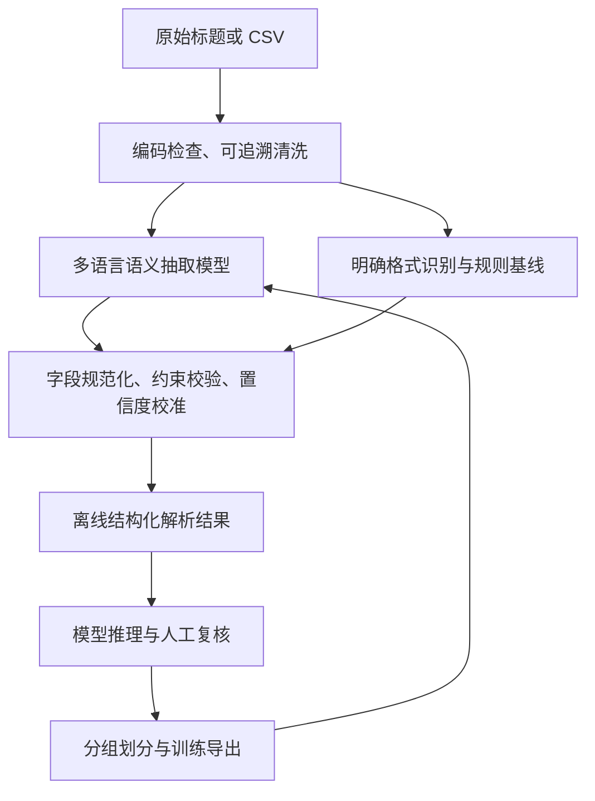

# Anitopy 多媒体标题语义识别重构实施方案

## 当前标题字段约定（2026-09-20，优先级最高）

训练数据以 `data.json` 中显式维护的 `$title_en` 和 `$title_cn` 为准。`$title_en` 是英文主标题，自动标注为 `TITLE`，并优先作为作品双隔离分区键；`$title_cn` 是中文名称，自动标注为 `TITLE_ALIAS`。此约定用于模拟真实下载文件名中的英文主标题，不从别名数组顺序猜测语言。

旧 `$title`、`$title_alias` 和 `$title_as_title_alias_1` 仅为兼容已存在模板而保留。标题字段语义变更后，必须重新生成训练数据、去重和双隔离分区；旧语义下尚未训练的 V5 产物不得用于后续训练或评测。

编写日期：2026-09-17。原项目：`E:\Code\anitopy`；新项目：`E:\Code\anitopy-ml`；输入数据：新项目根目录的 `data.csv`。

## 当前训练数据来源决策（2026-09-18，优先于本文早期方案）

训练数据改为仅由项目根目录的 `data.json` 生成。`data generate-synthetic` 按 `title`、各字段词表与 `name_template[].name` 生成标题文本，并根据替换字段自动写入原文片段和 BIO 标签；`title_alias_open`、`title_alias_separator`、`title_alias_close` 控制别名循环拼接，`subtitle_language_chs` 与 `subtitle_language_en` 均映射为 `SUBTITLE_LANGUAGE`。

- `data.csv` 保留为旧解析器基线、人工浏览或最终真实场景抽样输入，**不得用于训练、验证或测试数据生成**。
- 训练、验证、测试和自动标注均不使用外部作品库数据。
- 模板生成记录的来源固定为 `synthetic_template`，自动标签是模板确定性标签，不需要人工逐条审核后才能用于训练。
- 生成训练数据时默认将 70% 的样本抽自 `season_expr` 非空的标题条目，以增加季数与标题、别名相邻时的边界监督；可通过 `--season-rate` 在 0 到 1 间调整。
- 词表内的 `%random(位数)` 在每次模板渲染时替换为补零后的随机正整数。例如 `episode_expr` 的 `%random(2)` 生成 `01` 至 `99`，最终数值按 `EPISODE_EXPR` 自动标注，不能将占位符文本写入训练样本。
- 模板支持 `%random_range(起点-终点)` 生成不补零的闭区间随机整数，`$title_alias[1]` 选择第一个非空别名，`$random_month` 使用模板组内月份词表生成未标注格式文本；设置 `exclude_title_season_expr: true` 的模板只选择标题自身没有季数表达的条目，并由同模板组 `season_expr` 词表提供季数实体。
- 项目不再设置 300、500、4,000 或 10,000 条的训练数据目标或上限。生成命令的 `--count` 仅是一次运行的操作批次大小，不是项目训练集总量限制；可按需要分批生成、去重并合并训练分区。
- 验证与测试同样从模板数据按作品条目和模板组隔离生成，不能与训练集共用同一作品条目或同一模板实例。此类评测只证明对给定模板体系的泛化，不能表述为真实发布标题准确率。
- 人工审核页面继续用于检查模板规则、补充未来真实数据或观察模型输出，但不再是当前训练数据的前置条件。

本节与本文后续的“人工金标数量门槛”或“CSV用于训练”表述冲突时，以本节为准。

本文是待实施的功能设计和任务清单。文中的新模块、命令、模型文件和接口均为计划交付内容，当前尚未实现；已完成的工作仅包括代码调研、数据统计、旧用例结果比对和官方资料核查。所有准确率、硬件配置和时间安排中的目标值均须通过实施验证。

## 1. 目标、范围与核心决策

将主要依赖分隔符、关键词和数字位置的解析器，升级为能够结合上下文识别作品标题、别名、季集、字幕、发布组及音视频参数的语义解析系统。第一版覆盖动漫、电影和电视剧的资源标题与文件名，重点解决中文、日文、英文混排，以及合集、特别篇、标题内数字等问题。

这里的“多媒体信息识别”首先指从标题文本中提取媒体元信息，不等同于识别视频画面、语音或实际文件编码。只提供标题时，不能确认实际音轨、真实分辨率或文件完整性。后续可加入 `ffprobe` 文件探测，结果单独保存；音视频内容识别不纳入第一版。

实施采用以下决策：

1. **多语言编码器负责语义判断。** 使用预训练语言模型微调字段抽取和上下文分类，避免从零训练，也不把整套任务变成不断增加正则表达式。
2. **确定性代码负责格式与约束。** 编解码、偏移映射、数值范围、字段规范化、结构校验仍由代码完成；规则输出保留来源。
3. **解析默认本地、离线完成。** 不依赖外部作品库或网络服务。
4. **自动标注允许拒绝判断。** 无候选、有冲突、证据不足时进入复核，不强行匹配，也不把缺失字段当成负标签。
5. **以真实人工金标衡量提升。** 先冻结测试集，再训练；自动标注覆盖率不代表识别准确率。
6. **中文规范贯穿交付。** 自编代码注释、文档字符串、日志、报错、命令帮助、训练进度、标注界面、报告和演示交互全部使用中文。Python 标识符、JSON 键、模型名称、协议字段、语言代码等机器接口保留稳定英文形式。

## 2. 已核实的项目与数据现状

### 2.1 原项目

调研提交：`48bd0ad6f0d074c54e1694ee85d96828fd043209`。

| 文件 | 当前职责 | 重构处理 |
| --- | --- | --- |
| `anitopy/anitopy.py` | `parse(filename, options)` 入口、扩展名清理 | 保留为基线；新项目提供兼容适配器 |
| `anitopy/tokenizer.py`、`token.py` | 按分隔符和括号构造词元 | 作为规则基线；不能代替模型分词器 |
| `anitopy/parser.py` | 顺序查找关键词、数字、标题、发布组 | 迁移为基线适配；语义路径另建流水线 |
| `anitopy/parser_number.py` | 集数、季数、卷数及数字模式 | 复用明确格式的思路，重写有歧义的数值判断 |
| `anitopy/parser_helper.py`、`keyword.py` | 关键词及辅助规则 | 提取为可测试的规范化、校验功能 |
| `anitopy/element.py` | 字段枚举及标量/列表输出 | 新建强类型统一数据结构，再映射旧字段 |
| `tests/fixtures/table.py` | 常规回归样例 | 162 条，保留原始预期和来源 |
| `tests/fixtures/failing_table.py` | 已知失败样例 | 35 条，单列挑战集，修正预期需留痕 |

现有 `tests/test_anitopy.py` 的主用例结果断言被注释，失败用例中的断言异常被捕获后打印。因此“测试命令退出成功”不能证明解析正确。直接调用解析函数、去掉预期中的 `id` 辅助键、按原选项逐条比较完整字典，得到：

| 用例集 | 完全匹配 | 异常数 | 解释 |
| --- | --- | --- | --- |
| 常规用例 | 153 / 162，约 94.44% | 0 | 历史用例符合率，不是实际业务准确率 |
| 已知失败用例 | 0 / 35 | 0 | 必须继续细分具体字段和失败类型 |

`parse()` 还会通过 `setdefault` 修改调用者传入的选项字典；新适配器必须复制参数，避免共享可变状态。旧字段有字符串与列表混用、前导零等兼容要求，不能直接替换成整数后宣称兼容。

### 2.2 用户数据

使用 Python CSV 解析器以 UTF-8 读取，字段只有 `record_title`，没有人工标签、媒体类型真值或实际文件路径。

| 项目 | 实测结果 |
| --- | --- |
| 文件大小 | 3,626,488 字节 |
| 数据行数，不含表头 | 28,780 |
| 完全相同字符串去重后 | 28,780 |
| 空白标题 | 0 |
| 字符长度：最短 / 中位数 / P95 / 最长 | 4 / 83 / 123 / 905 |
| 含中日韩字符 | 28,657 |
| 含英文字母 | 28,774 |
| 命中 `S数字E数字` 模式 | 1,134 |
| 命中粗略中文季集模式 | 4,641 |
| 命中常见分辨率模式 | 16,880 |
| 命中独立四位年份模式 | 1,309 |
| 以常见视频扩展名结尾 | 40 |
| 命中网址或常见网页标签模式 | 1 |
| Unicode 替换字符 `U+FFFD` | 0 |

文件 SHA-256：`70bc1c39eecf43b10e5cb92799f7f504cd0d7159713f1815885eb7d1dd2424e1`。

这些模式计数只是数据剖析，类别之间可重叠，不能用作人工真值。数据没有 UTF-8 BOM；以 UTF-8 解码正常。部分 PowerShell 默认编码会造成显示乱码，不能据此批量修改源文件。CSV 导入必须使用 `csv.DictReader` 和 `newline=""`，不能按逗号或物理行手工拆分。

当前新项目仅声明 `requires-python = ">=3.14"`，无依赖；现有 `venv` 为 Python 3.14。实施阶段建议先建立单独的 Python 3.12 环境，确认机器学习依赖及部署平台支持后锁定版本，不直接沿用该环境训练。

### 2.3 从真实标题得到的重点问题

| 实际标题片段 | 原解析观察 / 需要解决的语义 |
| --- | --- |
| `Hataraki Man BDRemux 働きマン 工作狂人 1-11 内封英文字幕` | `BDRemux` 混入标题，字幕被当成集标题；需要分离多语言别名和字幕 |
| `(枪版)Chainsaw Man The Movie Reze Arc 2025 ...` | “枪版”被当作发布组，年份混入标题；需要识别来源与质量提示 |
| `2018通灵妃[第一季，全16集][4K].Psychic.Princess.S01` | 年份粘连标题，中文季集被当作发布组；“全16集”不等于第16集 |
| `29岁单身中坚冒险家的日常 - EP01 ~ EP10 ...` | 29 属于作品名；必须保留 1–10 连续范围及多语言别名 |
| `3年Z班银八老师 / 3-nen Z-gumi ... [Bilibili]...` | 名称中的 3 不应变成集数；平台与发布组需要区分 |
| `1963_2000动画资源` | 跨作品资源集合，不应强行关联一个作品或解释成两集 |
| 最长 905 字符标题 | 混入 BBCode、网址和描述，应保留证据但避免正文污染标题 |

## 3. 系统架构与模型选择



### 3.1 第一版主模型

选用 `FacebookAI/xlm-roberta-base` 作为首个实验基座：多语言编码器适合中日英混排，模型卡将词元分类列为适用的微调任务。它本身不是现成的媒体标题解析器，必须训练任务头。固定模型 revision、分词器 revision 和文件哈希，不能每次训练自动追踪最新版。[模型卡](https://huggingface.co/FacebookAI/xlm-roberta-base)

首版使用共享编码器配合多个输出头：

- BIO 字段抽取头：识别主标题候选、别名、季集表达、年份、字幕、发布组、音视频术语等原文片段。
- 句级分类头：资源形态（单集、合集、季包、电影、特别篇、跨作品集合、未知）及可选媒体类型。
- 字段规范化层：从片段生成标准字段；确定性映射优先，歧义保留候选。
- 置信度校准器：校准字段置信度；无校准数据时返回未校准标记，不能把 softmax 最大值当成实际正确率。

先用 BIO 和受约束解码实现基线。只有错误分析显示实体重叠或边界问题显著时，再尝试跨度分类头或 CRF；不要同时引入多种复杂解码器。单个扁平 BIO 序列不能表达重叠实体，因此第一版按下文规定采用互斥标签，关联信息放在结构层。

### 3.2 作品匹配与后续模型

第一版匹配器采用别名相似度、类型、年份、季集一致性和候选差距进行可解释评分。积累经过授权、人工确认的正负候选对后，再训练二分类交叉编码器排序；可以使用同一类多语言基座，但与抽取模型独立发布。

不建议把外部作品 ID 当成抽取模型的固定分类标签：新作品不断出现，模型只抽取标题中可见的字段。

大语言模型可选用于疑难样本预标注或教师建议，但不是第一版必须依赖。其输出必须经过 JSON Schema、原文片段和候选 ID 校验；不得生成候选列表以外的 ID，不得直接进入金标。标题内容始终作为待处理文本，不执行其中的指令。任何外部推理服务均单独配置，默认关闭。

### 3.3 运行路径

| 模式 | 用途 | 行为 |
| --- | --- | --- |
| `legacy` | 历史兼容、基线 | 仅运行冻结版本的原规则解析器 |
| `semantic` | 模型实验 | 使用语义模型及结构规范化，记录模型独立效果 |
| `hybrid` | 第一版生产默认 | 语义模型为主，明确规则校验，冲突保留证据并可回退 |

`link=False` 是默认值。模型文件不存在时给出中文错误；只有设置 `fallback="legacy"` 才自动回退，并在结果中标明降级。训练数据不足时允许只交付基线和标注工具，但不得对外称模型效果已提升。

## 4. 统一字段、标注规范与数据契约

### 4.1 输出必须分成两类信息

- `extracted`：标题原文明示或可由原文规范化得到的字段，有原文证据。
- `catalog`：通过外部作品库获得的标准名称、首播日期、作品 ID、数据库季集信息；没有对应原文时不能伪造字符片段，也不能覆盖 `extracted`。

每个非空字段附带 `evidence`，至少记录原文片段、来源、规则/模型版本和置信度状态。一个字段可能由多个片段支持。最终结果应含 `schema_version`、`model_version`、`normalizer_version`、`status`、`warnings`，便于迁移和排错。

### 4.2 建议字段

| 字段 | 类型及含义 | 关键约束 |
| --- | --- | --- |
| `title`、`title_aliases` | 主标题字符串、别名对象列表 | 原文标题不被库中标准标题替换；别名记录语言及片段 |
| `media_type` | `movie / tv / unknown` | 动画是内容属性，不是与电影/电视剧互斥的媒体类型 |
| `content_form` | `animation / live_action / unknown` | 无证据可为空或未知 |
| `release_kind` | `episode / season_pack / movie / special / collection / unknown` | “合集”再区分单作品与跨作品 |
| `year`、`year_role` | 整数及 `release / season / edition / unknown` | 标题中的数字不全部解释为发行年份 |
| `seasons` | 整数列表 | 不出现时不默认补第1季 |
| `episodes` | 集数项列表 | 保存原字符串、精确规范值及编号体系 |
| `episode_ranges` | 范围对象列表 | 保存起止，不自动展开所有中间集 |
| `declared_episode_count` | 声明总集数 | “全12集”是数量声明，不自动等价于已验证的1–12集 |
| `episode_title` | 字符串或空 | 不把字幕语言、制作说明当成集标题 |
| `special_type` | `OVA / OAD / SP / NCOP / NCED` 等 | 特别篇不自动映射到第0季 |
| `source`、`platforms` | 来源、平台列表 | `WEB-DL` 与 `Bilibili` 分别保存 |
| `resolution` | 宽、高、扫描方式、原始档位 | `4K` 可规范为档位，不保证实际宽高 |
| `video_codecs`、`video_encoders` | 编码格式、编码工具列表 | H.264/AVC 是格式；x264 是编码工具，分别保留 |
| `bit_depth`、`hdr_formats` | 位深、HDR 声明 | `10bit` 不等于 HDR；DV 与 HDR10 可并存 |
| `audio_codecs`、`audio_channels` | 编码列表、声道声明 | 支持 AAC、FLAC、DDP、2.0、5.1 等多值 |
| `audio_languages` | 语言代码列表 | 原作品语言不能推断成该资源音轨语言 |
| `subtitle_languages`、`subtitle_mode` | 字幕语言、内封/内嵌/外挂/未知 | 简繁中文使用 `zh-Hans`、`zh-Hant` |
| `release_groups`、`release_version` | 发布组列表、发布修订版 | 平台、字幕类型不等于发布组 |
| `file_extension`、`checksum`、`volume` | 扩展名、校验值、卷号 | 无扩展名输入仍正常解析 |

集数规范值建议用十进制字符串，例如 `"12.5"`，避免浮点误差；同时保留 `raw="01"`，兼容旧接口。编号体系使用 `season / absolute / unknown`；`S02E01` 和绝对集数 `13` 在没有映射证据时不能互相改写。

### 4.3 BIO 标签与边界

至少实现以下片段类型，BIO 前缀由训练导出器生成：

`TITLE`、`TITLE_ALIAS`、`EPISODE_TITLE`、`SEASON_EXPR`、`EPISODE_EXPR`、`YEAR`、`EPISODE_COUNT_EXPR`、`MEDIA_TYPE_HINT`、`SPECIAL_TYPE`、`RELEASE_GROUP`、`SOURCE`、`PLATFORM`、`RESOLUTION`、`VIDEO_TERM`、`BIT_DEPTH`、`HDR`、`AUDIO_TERM`、`AUDIO_LANGUAGE`、`SUBTITLE_LANGUAGE`、`SUBTITLE_MODE`、`RELEASE_VERSION`、`CHECKSUM`、`FILE_EXTENSION`、`VOLUME_EXPR`、`NOISE`。

边界约定：

1. 片段使用原始标题 Python 字符串的 Unicode 码点索引，左闭右开 `[start, end)`；必须满足 `raw_text[start:end] == text`。前端 JavaScript 的 UTF-16 偏移须显式转换。
2. `S01E03` 分成 `S01` 的季表达和 `E03` 的集表达；`EP01 ~ EP10` 整体标为 `EPISODE_EXPR`，规范化层解释范围。连字符、波浪线属于表达内部。
3. `全16集` 整体标为集数声明，不能同时重复标为第16集。
4. `AAC2.0` 整体使用 `AUDIO_TERM`，再拆编码与声道；不在一个 BIO 序列里重叠标注。
5. 字段外层装饰性括号不纳入实体，作品名称内部括号按名称组成保留。
6. 主标题默认选第一个完整作品名称片段；同作品的中日英名称进入别名。不能确认同一作品时保留歧义，不自动把所有斜杠两侧文本合并。
7. 对未人工确认的区域设为“未标注”，训练时屏蔽损失；只有审核员确认不属于任何字段的词元才可使用 `O`。
8. 需要嵌套信息时使用结构化属性或关系字段，不通过相互覆盖的片段解决。

### 4.4 标注样本示例

以下示例用于解释数据结构，编号和审核状态为示意，不代表已经完成此条人工标注：

```json
{
  "schema_version": "1.0",
  "sample_id": "示例样本-001",
  "raw_text": "示例作品 S01E03 1080p",
  "spans": [
    {"start": 0, "end": 4, "text": "示例作品", "label": "TITLE", "source": "human"},
    {"start": 5, "end": 8, "text": "S01", "label": "SEASON_EXPR", "source": "human"},
    {"start": 8, "end": 11, "text": "E03", "label": "EPISODE_EXPR", "source": "human"},
    {"start": 12, "end": 17, "text": "1080p", "label": "RESOLUTION", "source": "human"}
  ],
  "extracted": {
    "title": "示例作品",
    "seasons": [1],
    "episodes": [{"raw": "03", "value": "3", "numbering": "season"}]
  },
  "catalog": null,
  "annotation": {
    "tier": "gold",
    "review_status": "accepted",
    "unlabeled_regions": [],
    "reviewer_id": "审核员甲",
    "version": 1
  },
  "lineage": {
    "sources": ["user_csv", "human"],
    "training_allowed": true,
    "authorization_ref": null
  }
}
```

实际 `sample_id` 由源文件哈希、CSV 记录序号及原始标题哈希确定，另设规范化去重键。源文件记录位置和字符串哈希都要保留，保证同一输入断点续跑幂等。

## 5. 数据工程、金标与防止评测泄漏

### 5.1 导入与清洗

实现 `data ingest` 和 `data profile`：

1. 校验编码、表头、空值、异常长度，保存不可变原始数据和数据清单；输出使用 UTF-8。
2. 对全角字符、空白、分隔符生成规范化视图，但保留原文。NFKC、繁简转换和罗马字变体只用于检索辅助，不覆盖原文。
3. 对每次替换维护原文位置映射；涉及多字符对一字符或删除时使用区间映射，不能仅保存单一偏移差。
4. 为网址和 BBCode 建立噪声区域，过滤网页正文时保留被过滤位置；不能简单删除所有方括号内容。
5. 先做精确去重，再建立近重复和作品候选分组。数据虽然无完全重复，但同作品不同集、字幕组和清晰度仍高度相似。
6. 输入超过模型长度时分窗处理并记录覆盖范围；不得静默截断。最大输入长度可设为4096字符，超限返回中文提示或进入专门长文本任务。

### 5.2 人工标注规模与工作流

首轮建议人工精标约 4,000 条，按作品分组后目标分配为训练约 2,500 条、验证约 500 条、冻结测试约 1,000 条。分组优先，实际比例允许变化，报告真实数量。

抽样覆盖短标题、混合语言、纯英文、不同字幕组、电影/剧集、数字标题、合集、特别篇、无年份、低频音视频字段和未知作品。当前语料明显偏向动漫，电影与真人电视剧可能不足；先统计真实分布，再补充有来源记录的样本，不能仅靠合成数据宣称覆盖所有媒体。

金标流程：初标 → 第二人复核 → 冲突仲裁 → 版本冻结。测试集全部复核，训练集优先复核歧义样本。没有第二位审核人员时采用间隔复查并记录局限，不能声称双人一致率。以每条1–3分钟估算，4,000条初标约67–200人小时，另计复核和查证。

标注工具必须支持片段拖选、标签快捷键、范围编辑、候选作品比较、无法判断、保存进度、撤销、版本差异与审核状态。界面中文；原文之外的信息显示在独立的“作品库信息”区。

### 5.3 划分策略

- 以人工作品组或保守标题聚类分组。存在潜在同作品的组整体划分，不能将第1集放训练、第2集放测试。
- 优先使用作品级不重叠划分，并额外维护续作系列、近重复模板和发布组外推挑战集。
- 用约 80/10/10 作为全量数据分配目标；冻结测试必须完全人工审核，其余未标注样本只按既定组归属加入训练池，不自动充当验证/测试真值。
- 在生成增强样本、构建训练词典和训练排序器之前完成划分。任何增强样本继承父样本分组。
- 从测试集发现的别名、纠错规则和人工反馈不能再回流用于当前版本训练或阈值调优。后续使用需轮换测试集并记录版本。
- 外部作品库用于检索时可包含测试作品，但模型训练不包含该作品标签；报告须说明这是“给定作品库的关联评测”，与完全离线的新作品识别分开。

交付 `split_manifest.json`，记录样本、作品组、用途、随机种子、数据哈希、标注版本及授权血缘。划分冲突检测必须作为训练前必检项。

## 7. 代码目录与模块职责

建议在新项目实现，原项目作为固定基线，不在第一阶段直接覆盖原目录：

```text
anitopy-ml/
├── task.md
├── pyproject.toml
├── uv.lock
├── data.csv
├── configs/
│   ├── 数据处理.yaml
│   ├── 自动标注.yaml
│   ├── 抽取训练.yaml
│   ├── 候选排序训练.yaml
│   └── 推理.yaml
├── src/anitopy_ml/
│   ├── api.py                 # 面向用户的稳定调用接口
│   ├── schemas.py             # 输入、输出、标注和模型清单
│   ├── cli.py                 # 命令入口与中文帮助
│   ├── messages.py            # 中文提示和错误码映射
│   ├── normalizer.py          # 可追溯清洗与字符位置映射
│   ├── legacy.py              # 原项目基线与兼容映射
│   ├── constraints.py         # 季集、范围和字段冲突校验
│   ├── provenance.py          # 数据来源、版本和用途检查
│   ├── data/                 # 导入、统计、分组划分、增强
│   ├── annotation/           # 自动标注、审核与版本管理
│   ├── modeling/             # 编码器、输出头和解码器
│   ├── training/             # 数据集、损失、训练和评测
│   ├── inference/            # 模型加载、批处理和置信度校准
│   └── serving/              # 可选 HTTP 服务
├── tools/
│   ├── review_app.py          # 中文人工审核页面
│   └── smoke_train.py         # 小样本训练全链路自检
├── tests/
│   ├── unit/
│   ├── integration/
│   ├── regression/
│   └── fixtures/
├── data/
│   ├── raw/
│   ├── processed/
│   ├── annotations/
│   ├── splits/
│   └── cache/
├── artifacts/                # 检查点、可发布模型和校准文件
├── reports/                  # 中文统计、评测和差异报告
└── docs/
    ├── 标注规范.md
    ├── 训练指南.md
    ├── 调用指南.md
    └── 模型说明.md
```

保留原项目的 MPL 2.0 许可与版权声明；复用文件时标明来源和改动。依赖使用可选组分离：基础库（数据结构、配置、规范化）、`train`（PyTorch、Transformers、训练指标）、`review`（Streamlit 或等价本地界面）、`serve`（FastAPI 等）、`dev`（测试与静态检查）。SQLite 使用标准库即可。

具体版本在环境验证后写入锁文件；分别验证 Windows CPU 推理和实际训练 GPU 环境。CUDA 版本、PyTorch 构建与显卡驱动要一起记录，不根据“Python可以启动”推断训练栈可用。

## 8. 训练工具的具体实现

### 8.1 必须实现的命令

统一入口为 `anitopy-ml`，英文命令作为稳定机器接口，所有帮助及输出中文。

| 命令 | 输入 / 输出 | 必须具备的行为 |
| --- | --- | --- |
| `doctor` | 环境、配置 → 中文检查报告 | 检查依赖、设备、模型文件、可选凭证；不打印凭证 |
| `data ingest` | CSV → 原始 JSONL、清单 | 编码、行号、哈希、幂等导入 |
| `data profile` | JSONL → JSON/HTML 报告 | 长度、语言模式、重复与类别分布 |
| `baseline` | 数据/金标 → 基线结果 | 冻结旧版本，输出字段差异与异常 |
| `annotate seed` | 标题 → 规则预标注 | 保留未标注区域，不把旧结果当真值 |
| `annotate auto` | 候选＋标题 → 银标建议 | 片段校验、阈值、冲突隔离 |
| `review` | 标注库 → 中文审核界面 | 修改、仲裁、版本管理和队列筛选 |
| `data split` | 审核数据 → 划分清单 | 按作品/近重复分组，检测泄漏 |
| `data export` | 标注库＋划分 → 训练集 | 标签映射、部分标签屏蔽、许可血缘校验 |
| `data augment` | 训练集 → 增强集 | 仅增强训练分组，保持字符位置正确 |
| `train extractor` | 配置＋数据 → 抽取模型 | 恢复训练、混合精度、早停、中文指标 |
| `train ranker` | 经审核候选对 → 排序模型 | 正负采样、同作品组隔离、空匹配类别 |
| `calibrate` | 验证集预测 → 校准文件 | 字段阈值与关联阈值分开拟合 |
| `evaluate` | 模型＋冻结测试 → 报告 | 分层指标、与基线比较、误差样本 |
| `export` | 最佳模型 → 发布目录 | 保存全部推理依赖和自检样例 |
| `parse`、`batch` | 标题/CSV → JSON/JSONL | 本地推理、稳定顺序、逐项错误 |
| `serve` | 模型 → 本地 HTTP 服务 | 默认绑定127.0.0.1、健康检查 |

全量和长任务支持 `--limit`、`--resume`、`--dry-run` 及明确输出目录。`--dry-run` 只检查和估算，不联网、不训练、不改标签；交互默认不得偷偷开始全量抓取。

### 8.2 中文交互示例

```text
正在导入标题：已处理 12000 / 28780 条
候选匹配完成：可自动接受 615 条，待复核 282 条，未匹配 103 条
第 2 / 6 轮训练：验证集实体 F1 为 0.942，最佳模型已保存
该标题可能对应多个作品，请选择候选或标记为“无法判断”
错误：未找到模型文件，请先完成模型导出或指定正确的模型目录
错误：当前数据来源未获准用于训练，请检查用途配置和数据血缘
```

以上数字只用于演示提示格式。统一异常类型和错误码；项目捕获可预期的第三方异常后转为中文业务说明，调试详情单独保存。命令框架默认英文的帮助标题、校验提示，Web 框架默认英文的422响应，以及训练库默认日志都需要适配；不承诺改变操作系统或第三方程序自身的外部输出。

### 8.3 数据集和损失函数

输入为原始或带位置映射的规范化文本。使用 fast tokenizer 的 `offset_mapping` 将字符片段对齐到子词；特殊词元、填充、未标注区域和无法无损对齐的边界设为 `-100` 或等价损失掩码。对齐失败率须出报告，不能静默改变金标边界。Hugging Face 的词元分类文档说明了子词与标签对齐、忽略特殊词元和动态填充的基本做法；中文无空格输入应使用字符偏移方案实现。[词元分类文档](https://huggingface.co/docs/transformers/tasks/token_classification)

长度默认从256词元开始，在真实分词统计后决定是否采用384或512。字符长度不等于词元长度。超过上限的输入使用滑窗，例如重叠64词元；每个窗口保留全局偏移，同一实体合并并校验，不完整边界需标记。训练和推理使用同一策略。

首版损失：

```text
总损失 = 字段抽取损失
       + 0.2 × 资源形态分类损失
       + 0.2 × 媒体类型分类损失
```

权重为初始实验配置。标签缺失的任务不计算该项损失；按有效标签数归一化，避免长标题占据全部梯度。金标样本权重先设1.0，银标0.3–0.5，弱标默认0。类别不平衡先通过采样处理，再考虑损失加权，并用验证集决定。

### 8.4 建议训练配置

以下文件是计划中的配置格式，需由配置 Schema 校验；第一轮先选择已固定的模型 revision。

```yaml
# 所有路径相对于项目根目录解析
seed: 42
model:
  name: FacebookAI/xlm-roberta-base
  revision: 待填写并锁定的提交号
  max_length: 256
  stride: 64
data:
  manifest: data/splits/split_manifest.json
  train: data/processed/train.jsonl
  validation: data/processed/validation.jsonl
  require_training_permission: true
training:
  epochs: 6
  learning_rate: 0.00002
  head_learning_rate: 0.0001
  weight_decay: 0.01
  warmup_ratio: 0.1
  batch_size: 8
  gradient_accumulation_steps: 4
  gradient_clip_norm: 1.0
  precision: auto
  early_stopping_patience: 2
  selection_metric: entity_micro_f1
  output_dir: artifacts/runs/抽取实验一
labeling:
  gold_weight: 1.0
  silver_weight: 0.4
  weak_weight: 0.0
```

有效批量为32。建议先用单张16–24GB显存GPU验证该配置；这是预估起点，实际显存由序列长度、优化器状态和实现决定。8–12GB显存可尝试降低批量、梯度累积、梯度检查点或冻结底层，必须先跑小批量显存测试。CPU支持小样本自检和推理，完整微调耗时要实测，不给固定完成时间承诺。

### 8.5 完整训练顺序

1. 用32–64条金标运行自检：检查标签对齐、损失下降、模型保存/加载及预测结构；验证小集合能被拟合，以发现训练代码错误。
2. 建立实验A：只用人工金标训练抽取模型，得到无伪标签干扰的基线。
3. 建立实验B：在相同训练分组和随机种子下加入通过抽检的银标，比较是否真实提升。
4. 建立实验C：加入训练集增强，比例初始不超过训练样本的30%；真实样本仍为主体。
5. 增强仅改变分隔符、括号、字段顺序、可验证别名或季集表达；变换同时重建标签及偏移。不能任意把作品季数、年份和名称拼接成矛盾样本。
6. 使用验证集选择模型与阈值；对最佳配置用3个随机种子复测稳定性。冻结测试在配置确定后一次性用于发布评测。
7. 有足够合法候选对时单独训练排序器：每个正例配3–5个难负例，包含同名不同年份、电影/TV冲突和续作；没有正确候选的样本保留空匹配监督。
8. 校准字段分数及候选接受策略；比较错误率随覆盖率的变化，不只报告单一准确率。
9. 导出最佳模型、标签表、分词器、规范化配置、校准器、数据与代码版本、环境锁文件、许可证及中文模型说明。
10. 如需 ONNX 或量化，单独验证与原模型的字段一致率、精度损失和CPU延迟；未通过则保留 PyTorch 推理。

检查点保存优化器、调度器、随机状态、混合精度状态及已完成轮次，保证 `--resume` 真正续训。发布目录只包含推理所需文件；训练产物和发布产物分开管理。

## 9. 拟交付命令的端到端使用步骤

以下命令只有在对应工具实现后才可执行，不表示当前仓库已经支持。所有命令在 `E:\Code\anitopy-ml` 下运行。

### 9.1 环境准备及自有数据路径

开发阶段先调整 `pyproject.toml` 的 Python 支持范围及可选依赖，再创建 `.venv` 并锁定依赖。不要覆盖现有 `venv`。

```powershell
# 首次配置阶段安装和选择经过验证的 Python 版本
uv python install 3.12
uv venv --python 3.12 .venv
uv sync --extra train --extra review --extra dev

# 验证环境，导入数据并生成中文统计报告
uv run anitopy-ml doctor
uv run anitopy-ml data ingest --input data.csv --column record_title --output data/raw/titles.jsonl
uv run anitopy-ml data profile --input data/raw/titles.jsonl --output reports/数据概况.html
uv run anitopy-ml baseline --legacy-source E:\Code\anitopy --input data/raw/titles.jsonl --output reports/旧解析结果.jsonl

# 生成可审核建议并进入人工标注
uv run anitopy-ml annotate seed --input data/raw/titles.jsonl --output data/annotations/labels.sqlite
uv run anitopy-ml review --database data/annotations/labels.sqlite
```

训练依赖首次锁定完成后，CI和复现实验改用 `uv sync --frozen` 并携带相同可选组；安装GPU版PyTorch的来源在环境配置中单独固定。

### 9.3 划分、训练、评测与发布

```powershell
# 使用审核后的作品分组，固定训练、验证和测试归属
uv run anitopy-ml data split --database data/annotations/labels.sqlite --group-by work --seed 42 --output data/splits/split_manifest.json
uv run anitopy-ml data export --database data/annotations/labels.sqlite --manifest data/splits/split_manifest.json --output data/processed

# 完成小样本训练自检后，开始正式抽取训练
uv run python tools/smoke_train.py --config configs/抽取训练.yaml --limit 64
uv run anitopy-ml train extractor --config configs/抽取训练.yaml
uv run anitopy-ml calibrate --model artifacts/runs/抽取实验一/best --data data/processed/validation.jsonl
uv run anitopy-ml evaluate --model artifacts/runs/扩容V6英文主标题种子1 --test data/synthetic/扩容V6英文主标题双隔离分区/test.jsonl --output reports/模型评测/扩容V6英文主标题冻结测试.json --device cuda
uv run anitopy-ml export --model artifacts/runs/抽取实验一/best --output artifacts/releases/媒体解析模型-v1

# 使用已导出的模型进行离线推理
uv run anitopy-ml parse "示例作品 S01E03 1080p 简体中文字幕" --model artifacts/releases/媒体解析模型-v1
uv run anitopy-ml batch --input data.csv --column record_title --model artifacts/releases/媒体解析模型-v1 --output reports/批量解析.jsonl
```

排序器训练作为独立可选步骤：`train ranker --config configs/候选排序训练.yaml`。该配置必须指向与抽取实验一致的作品划分清单及已经审核的候选对，不能自动使用全部匹配结果训练。

## 10. 模型发布、加载与方法调用

### 10.1 稳定接口契约

```python
class MediaParser:
    """加载媒体标题模型，提供单条和批量解析接口。"""

    @classmethod
    def from_pretrained(cls, model_dir, *, device="auto", offline=True,
                        fallback="error", linker=None):
        """加载本地模型；模型不完整时按指定策略处理。"""
        ...

    def parse(self, title, *, mode="hybrid", link=False, options=None):
        """解析单条标题，返回包含证据和版本的解析结果。"""
        ...

    def parse_batch(self, titles, *, batch_size=32, link=False,
                    on_error="record"):
        """保持输入顺序批量解析，按配置记录单条错误。"""
        ...

    def link(self, result, *, top_k=5):
        """通过显式配置的关联器补充作品候选，保留原始字段。"""
        ...


def parse(filename, options=None):
    """使用旧规则行为返回兼容字典，供原项目迁移阶段调用。"""
    ...
```

`MediaParser.parse()` 返回强类型 `ParseResult`，提供 `model_dump()`、`model_dump_json()` 和 `to_legacy_dict()`。`options` 每次复制并验证；未知配置给中文提示。顶层兼容 `parse()` 默认保留冻结的旧行为，语义增强通过 `MediaParser` 显式启用，不在升级后悄悄改变旧调用输出。

`offline=True` 表示禁止网络，既禁止自动下载模型，也禁止网络作品查询。如配置只读本地作品缓存，可通过单独的本地关联器使用；默认无关联器。`link=True` 与 `offline=True` 且关联器需要联网时立即报中文配置错误，不隐式联网。

### 10.2 Python 离线调用示例

```python
from anitopy_ml import MediaParser

# 模型在进程启动时加载一次，后续调用复用实例
parser = MediaParser.from_pretrained(
    r"E:\Code\anitopy-ml\artifacts\releases\媒体解析模型-v1",
    device="cpu",
    offline=True,
)

result = parser.parse(
    "29岁单身中坚冒险家的日常 - EP01 ~ EP10 [简／繁] (1080p H.264 AAC SRTx2)",
    link=False,
)
print("识别标题：", result.extracted.title)
print("集数范围：", result.extracted.episode_ranges)
print("完整解析结果：", result.model_dump_json(indent=2))

# 输出顺序与输入顺序一致，单条失败保留对应位置
results = parser.parse_batch(
    ["示例作品 S01E03 1080p", "另一部作品 全12集 简体中文字幕"],
    batch_size=16,
)
for item in results:
    print("解析状态：", item.status)
```

完整结果的预期行为：标题中的“29”保留在名称中，集数为连续范围1–10，字幕为简繁中文，H.264与AAC分别进入对应字段。没有季数时保持季未知，没有文件后缀时不补 `.mkv`。这是验收目标，不是当前已有模型的实测输出。

### 10.4 旧方法兼容

```python
from anitopy_ml import parse

# 保留旧字段和旧选项习惯，内部复制选项避免修改调用者数据
options = {"parse_episode_number": True}
legacy_result = parse("[示例字幕组] 示例作品 - 01 [1080p].mkv", options=options)
print("兼容解析结果：", legacy_result)
```

兼容层需覆盖旧字段的字符串/列表形态、缺失字段省略规则、前导零、空输入返回行为及全部现有选项。新结果转旧字典时：`title → anime_title`、`seasons → anime_season`、集数及范围端点按旧约定转换、`year → anime_year`；技术术语优先使用原文形式。兼容字典不能表达范围语义、证据和不确定性，转换时保留中文警告或通过单独字段报告，不能声称转换无损。

### 10.5 可选 HTTP 服务

在 Python 库稳定后提供 `POST /v1/parse`、`POST /v1/parse-batch`、`GET /health` 和 `GET /v1/model`。请求与响应复用相同 Schema，批量默认上限100条，标题长度限制和超时可配置。

```json
{
  "title": "示例作品 S01E03 1080p",
  "mode": "hybrid",
  "link": false
}
```

验证错误返回稳定错误码及中文 `message`，例如 `INPUT_EMPTY` / “标题不能为空”。默认本地监听；需要远程访问时再加入鉴权和部署配置。服务启动时加载模型并预热，不能每个请求重新下载或加载权重。

### 10.6 发布包必须包含

模型权重（优先安全的权重格式）、分词器文件、模型配置、标签映射、Schema版本、规范化规则、校准参数、训练数据清单哈希、代码提交、依赖锁定信息、许可说明、中文模型卡和一组加载自检样例。发布包应可断网加载；下载模型与业务推理分成两个步骤。

## 11. 评测指标、回归测试与上线门槛

### 11.1 指标定义

| 维度 | 指标 | 计算边界 |
| --- | --- | --- |
| 字段抽取 | 严格片段级 Precision / Recall / micro-F1、macro-F1 | 字段类型和边界同时正确才算命中，排除未标注区域 |
| 字段规范化 | 标题准确率、季集完全正确率、范围/集合一致率 | 规定前导零、大小写、别名接受规则；不把区间展开错误隐藏 |
| 完整解析 | 整条关键字段完全正确率 | 在人工确认的适用字段上比较，缺失与错误都扣分 |
| 作品检索 | Recall@5、Recall@20 | 仅对作品库存在且人工确认的样本评估召回 |
| 拒绝判断 | 选择性错误率、覆盖率曲线 | 防止全部拒绝却得到看似很高的精确率 |
| 标注质量 | 银标抽检精确率、复核一致性 | 分字段、分来源统计 |
| 工程性能 | 冷启动、热启动P50/P95、吞吐、内存/显存 | 标注设备、线程、长度和批量；网络关联单列 |

评测中 `unavailable` 算依赖失败，`unmatched` 算关联结果；不能剔除所有失败请求后只汇报成功样本准确率。实体聚合置信度不直接取每个词元最高分的平均值作为“正确率”，须以验证集校准及可靠性图评估。

### 11.2 第一版目标

以下是待验证的建议门槛，最终以金标规模和业务容错要求调整：

- 在同一冻结测试集上，混合模式关键字段整条完全正确率相对旧规则至少提升10个百分点；若旧基线已超过90%，改用错误率下降≥30%作为可达的替代目标，并同时报告绝对变化。
- 主标题规范化准确率目标≥95%；季集在适用样本上的完全正确率≥97%；分辨率和明确编码字段准确率≥98%。必须注明样本数量与覆盖率。
- 自动关联作品的精确率目标≥98%，在人工确定可关联的样本中覆盖率目标≥80%；未达到时优先收紧自动通过范围，报告尚未达标。
- 关键困难类型逐类报告，不允许靠常见字幕组样本掩盖电影、特别篇或混合语言明显退化。与基线使用配对比较，并按作品组自助采样估计95%置信区间。
- `legacy` 兼容模式在162条常规、35条已知失败用例上复现冻结旧实现输出；“复现旧输出”和“符合人工正确预期”分开验证。语义模式应修正旧错误，不要求复刻错误。
- 暂定目标设备在热启动、批量1、输入≤256词元时CPU P95≤300毫秒作为优化目标；设备确定后实测修订，网络关联延迟不混入该指标。

### 11.3 必须编写的有效测试

1. UTF-8 CSV、带逗号/引号/换行标题、空标题、异常长度、网页标签和Unicode偏移回映射。
2. `29岁`、`3年Z班`、`86` 等标题数字；`S02E03`、`01-12`、`01&03`、`12.5`、`全12集`、`第十二集`、特别篇及未知季的不同语义。
3. 字段多值、音轨与字幕语言分离、x264与H.264映射、4K声明不伪装实际宽高。
4. 原选项字典不被修改、旧字段类型/缺失行为、批量顺序及单条错误隔离。
5. 模型标签对齐、部分标签掩码、滑窗合并、保存/加载一致性、训练/推理规范化一致性。
7. 候选歧义、库外作品、错误类型和年份、全集数量与季集映射冲突；未授权用途数据不能被训练导出。
8. 数据划分作品交叉、近重复泄漏、测试派生增强、授权血缘缺失的拒绝检测。
9. 中文帮助、可预期错误和页面提示检查；测试只验证关键文案及行为，不为每条静态文案堆砌镜像测试。
10. 离线模式无网络访问、模型缺失时错误清晰、显式回退可追踪；服务模式与库模式输出一致。

线上初期使用影子对比：保留原结果，同时运行新模型并记录差异；先复核高频差异，再切换默认路径。模型版本、词典与校准器作为同一发布单元，可以回滚到上一包，不依赖临时改规则。

## 12. 分阶段实施任务与验收

建议由一个开发者串行推进工程任务，另行安排人工审核；下表为粗略工程工作量，不含完整标注工时。每阶段都有独立产物。

| 阶段 | 任务与代码工作 | 产物 / 验收 | 预计工作量 |
| --- | --- | --- | --- |
| P0 基线与契约 | 冻结旧代码、建立可执行比对、定义Schema与中文规范、验证Python环境 | 基线报告、字段规范、依赖锁定；可复现153/162及0/35 | 2–3日 |
| P1 数据工具 | CSV导入、清洗偏移、统计、聚类、标注存储、划分清单 | 28,780条可重复导入，无损追踪；泄漏检查可运行 | 3–4日 |
| P2 人工标注工具 | 中文审核界面、片段编辑、版本与仲裁、数据导出 | 完成首批300–500条金标及标签规范修订 | 3–5日 |
| P4 抽取模型训练 | 编码器与任务头、掩码损失、滑窗、恢复训练、评测 | 小样本自检通过；金标实验与银标实验可比较 | 5–7日 |
| P5 推理与兼容 | 离线加载、混合判定、置信度、批量、旧API、可选关联器 | 方法调用示例可运行；兼容与离线测试通过 | 3–5日 |
| P6 验收与发布 | 分层评测、CPU性能、中文文档、模型打包、回滚 | 冻结测试报告、模型卡、安装训练调用指南 | 3–5日 |
| P7 可选优化 | 候选排序模型、量化/ONNX、影子对比与主动学习 | 有对照实验依据后纳入发布，不达标则保留现方案 | 3–5日 |

依赖关系：P0→P1→P2→P4；P5与P6使用已经验收的模型和契约。

### 12.1 可直接用于开发追踪的清单

- [ ] 冻结原项目提交及许可文件，建立独立回归比对程序。
- [ ] 验证Python、PyTorch、Transformers及目标设备组合，建立锁文件。
- [ ] 实现输出Schema、原文证据、未知值与中文错误规范。
- [ ] 实现CSV导入、数据统计、清洗和双向字符位置映射。
- [ ] 编写标注规范，建立近重复与作品分组。
- [ ] 实现中文标注/复核界面，完成第一批金标。
- [ ] 固定测试集、验证集及各样本所属作品组。
- [ ] 实现自动标签建议、置信度策略和抽检报告。
- [ ] 实现训练导出，屏蔽未知标签，阻止泄漏与不允许用途的数据。
- [ ] 实现语义抽取模型、训练器、检查点恢复与中文训练报告。
- [ ] 比较金标、银标和增强实验，确定首版模型。
- [ ] 完成校准、独立冻结测试和困难样本评测。
- [ ] 实现离线Python接口、批量CLI与旧API兼容。
- [ ] 完成模型打包、断网加载测试、CPU性能报告和回滚验证。
- [ ] 交付中文训练指南、调用指南、模型卡和可复制运行示例。

## 13. 持续改进与扩展

每轮发布后从“模型低置信度、规则与模型冲突、用户纠错、未见发布组、新作品、新格式”中抽样，组成下一轮主动学习队列。先审核再训练，新增样本按作品组进入相应分区；线上预测不能直接当成真值。以固定周期比较数据分布、字段缺失率和误关联率，决定是否重训。

如果后续提供真实文件路径，可增加显式的 `probe_file(path)`：通过 `ffprobe` 读取流信息，并把结果存入 `observed_media`。标题声明保存在 `extracted`，实际探测保存在 `observed_media`，两者冲突时给中文提示；不静默覆盖历史信息，也不因为标题中的网址而下载文件。

扩展到电影和真人电视剧时单独补足金标与测试集；扩展到海报、字幕正文、音频或视频画面时重新定义任务和数据集，不沿用标题抽取模型的准确率作为多模态性能证明。

## 14. 最终交付定义

本功能完成时应同时具备：可维护的语义解析代码、中文训练和审核工具、可复现的训练数据划分和评测报告、可离线加载的模型、兼容旧调用的适配接口，以及覆盖安装、标注、训练、发布和调用的中文文档。

验收以真实金标效果和上述可运行产物为准；方案文档完成、工具可以启动、API返回成功或训练损失下降，都不能单独视为识别功能已经完成。
